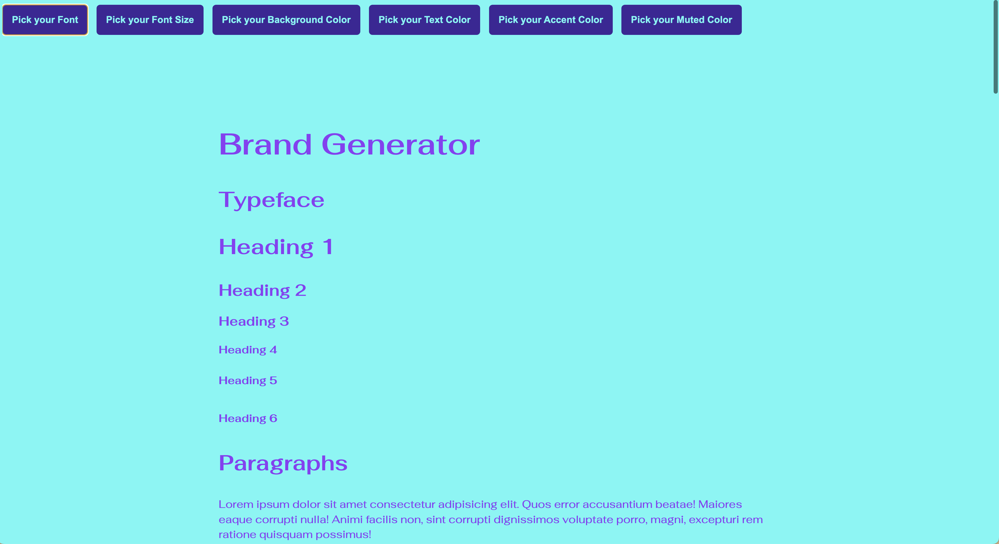

# Automatic Brand Generator'

This is a proof of concept for a brand generator website, written in vanilla JavaScript. Click the buttons to randomly select your new 'Brand Identity' and then export your new brand when you're happy with it.

### Version 1 Issues
There are a few serious flaws with this project. The JS is not well written or maintainable, and I should have created dropdowns and color pickers instead of having to click randomly until you find something you like. However, it exports a clean and thoughtful stylesheet, and an HTML file with everything you'd need to show off your brand as a proof of concept.

## Preview

## Contributing
If you'd like to contribute to this repository feel free to fork/submit a pull request, and if you have any suggestions feel free to email me at abbeyyacoe@gmail.com.

## License
The theme is available as open source under the terms of the MIT License.